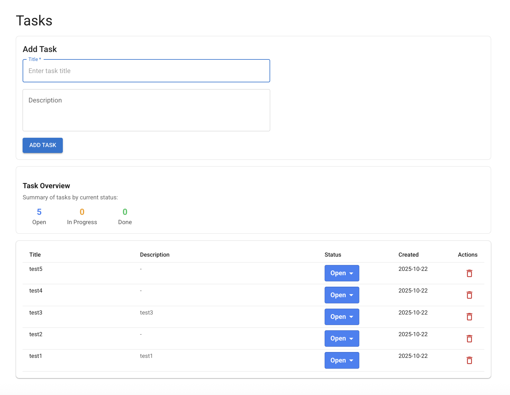
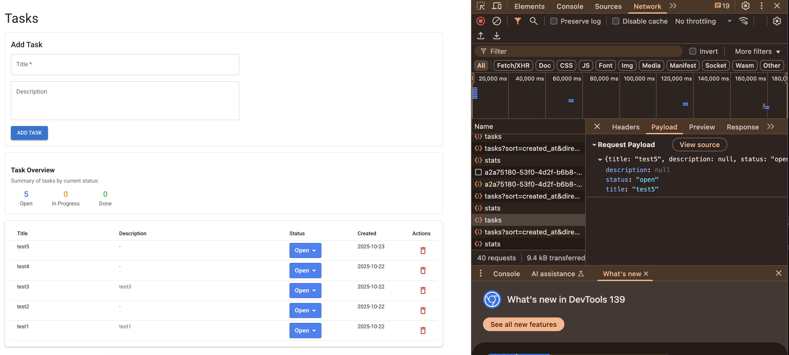
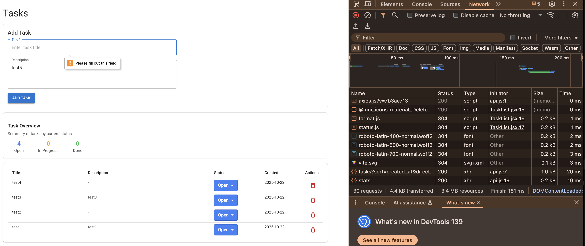
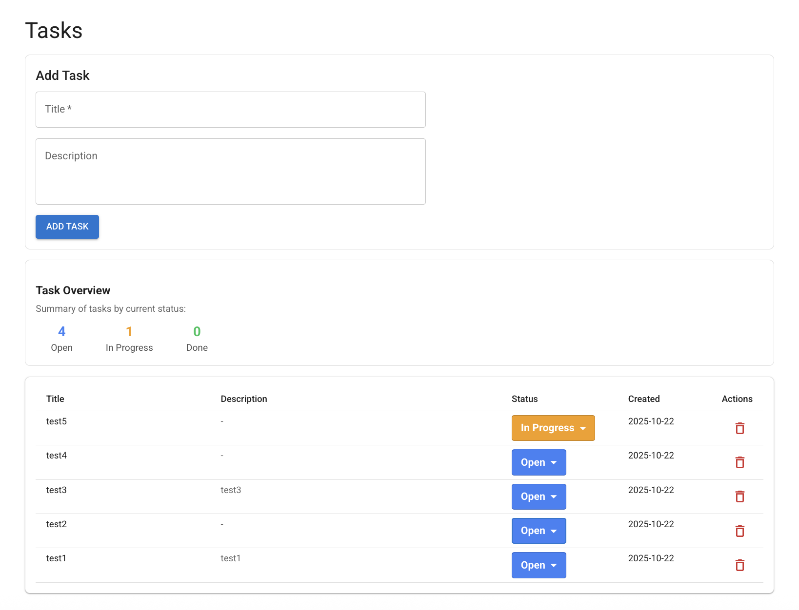
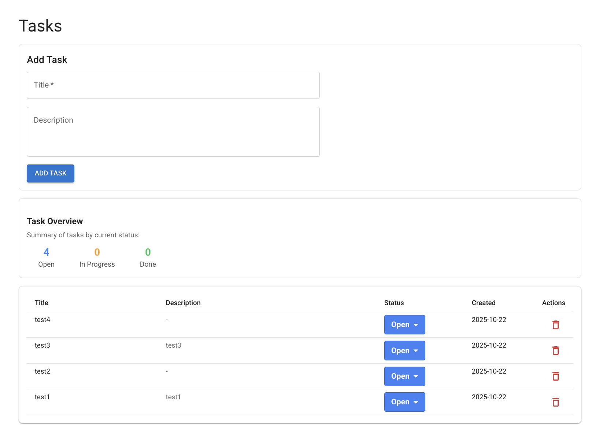

# To Do Service – Full Stack Project

A full-stack to-do task management system built with **Python (FastAPI)** for the backend and **React.js** for the frontend.  
The app supports creating, listing, filtering, updating, and deleting tasks, with clear interface.

---

## 🛠 Setup Instructions

### 1. Clone the repository
```bash
git clone https://github.com/TalCGA/todo-service.git
cd todo-service
```

### 2. Backend setup (Python + FastAPI)
Create a virtual environment and install dependencies:
```bash
cd backend
python3 -m venv venv
source venv/bin/activate 
pip install -r requirements.txt
```

Run the backend locally:
```bash
uvicorn main:app --reload
```
The API will be available at **http://localhost:8000**

---

### 3. Frontend setup (React + Vite)
In a separate terminal:
```bash
cd frontend
npm install
npm run dev
```
The app will be available at **http://localhost:5173**

Make sure the backend is running before opening the frontend.

---

## 📡 API Usage

### Base URL
```
http://localhost:8000
```

### 1. Get all tasks
```bash
curl "http://localhost:8000/tasks?limit=10&offset=0&sort=created_at&status=open"
```

### 2. Create a new task
```bash
curl -X POST http://localhost:8000/tasks   -H "Content-Type: application/json"   -d '{"title": "Buy groceries", "description": "Milk, eggs, and bread"}'
```

### 3. Update task status
```bash
curl -X PATCH http://localhost:8000/tasks/1   -H "Content-Type: application/json"   -d '{"status": "in_progress"}'
```

### 4. Delete a task
```bash
curl -X DELETE http://localhost:8000/tasks/1
```

### 5. Analytics – task counts by status
```bash
curl http://localhost:8000/tasks/stats
```

Example response:
```json
{
  "open": 4,
  "in_progress": 2,
  "done": 5
}
```

---

## 💻 Frontend Overview

- **Task List:** Displays all tasks with title, status (select dropdown), and created date.
- **Create Form:** form to add a new task (title + optional description).
- **Status Control:** Dropdown allows changing status (`open → in progress → done`).
- **Delete Action:** Button for removing a task with confirmation.
- **Analytics Section:** Shows task counts by status.

The UI is responsive, and uses **Material UI** for base styling with light customization.

---

## 🧩 Architecture Notes

**Languages & Frameworks**
- **Backend:** Python (FastAPI)
- **Frontend:** JavaScript (React + Vite)
- **Database:** SQLite (local embedded database)
- **Styling:** Material UI (MUI)

**Data Model**
```python
Task {
  id: int
  title: str
  description: Optional[str]
  status: str  # open | in_progress | done
  created_at: datetime
}
```

**Design Decisions**
- FastAPI was chosen for its simplicity, async support, and strong typing.
- SQLite was used for easy local setup and portability.
- React provides clean and modular client-side logic.
- Pydantic was selected for schema modeling and validation to keep API input/output definitions explicit and maintainable.
- The frontend uses MUI components for consistent and modern styling.
- The app is designed to be responsive and intuitive with minimal configuration.
- Clear separation between `services`, `components`, and `utils` ensures maintainability.

---

## 🧩 Assumptions

During development, several practical assumptions were made to align the solution with the assignment’s scope and time frame:

- The system is **single-user** (no authentication logic).  
- **SQLite** was used for simplicity and local persistence.  
- **Status values** are limited to `open`, `in_progress`, and `done`.  
- **Filtering** by date refers to the task’s creation date (without time granularity).  
- **Validation** relies on **Pydantic** for input schema enforcement and field-level checks,  
  providing consistent type validation and cleaner error handling.
- Basic required field validation (e.g., missing title) is handled at the frontend level using form validation.  
  Backend-side validation is also enforced via Pydantic models to ensure data integrity if requests are sent directly to the API.
- **All timestamps** are stored in UTC for consistency.  
- **Frontend focus** is on functionality and responsiveness rather than design.  
- **Error responses** follow HTTP standards (400, 404, 500) with descriptive messages.  
- **Analytics** provides only aggregate task counts per status.

---

## 🏆 Bonus Features Implemented

Although the bonus section was optional, selected enhancements were added to strengthen the project’s functionality and user experience:

### 🔹 Filtering & Sorting
Added query parameters for filtering by task `status` or `date`, including pagination (`limit`, `offset`) and sort direction.  
This allows a more flexible and scalable task retrieval API.

### 🔹 Analytics Endpoint (`/tasks/stats`)
Implemented a lightweight analytics endpoint returning a count of tasks per status.  
The frontend displays this information in a **Task Overview** summary card for better visibility of task distribution.

### 🔹 Frontend Enhancements
- Utilized **Material UI (MUI)** components for clean and consistent design.  
- Added **responsive layout** and visual feedback for loading and errors.
- Included a **delete confirmation** before removing a task, to prevent accidental deletions.  
- Focused on accessibility and intuitive UX while keeping the UI minimal as required.

---

## 📸 Screenshots

Below are several screenshots demonstrating the core features and validation flows of the To-Do Task Management app.

### Main View

_The main interface showing the task list, add task form, and task overview (Analytics) section._

### Task Creation

_A user adding a new task. Required fields are validated before submission, and View from the browser Network tab showing the API call structure and payload sent to the backend._

### Validation Example

_Example of frontend validation when the title field is missing — enforced before API call._

### Status Update

_Changing task status updates the list and summary._

### Task Deletion

_How it looks after confirming the deltetion (with live update of the task overview (Analytics))._

---

### Author
Developed by **Tal Chaushu Gur Arie**
